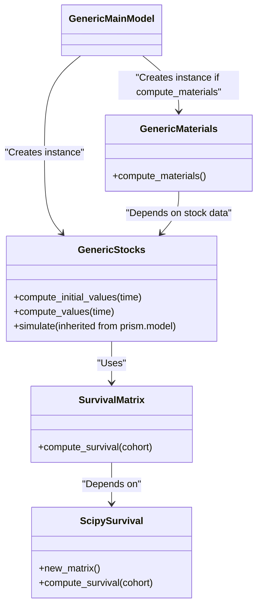
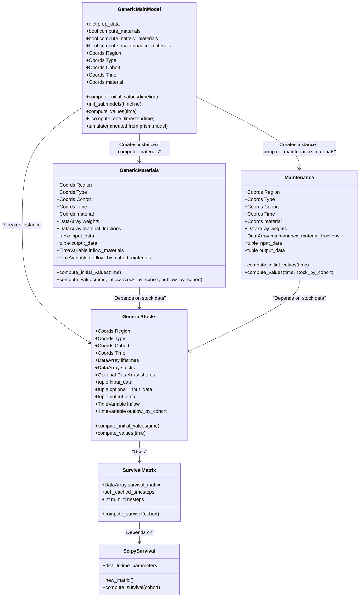

## Introduction
**IMAGE-Materials** is a standalone stock and material model that converts service demand data (e.g., kilometers traveled, goods transported, or square meters of built space) into product stock, such as vehicles, buildings, and roads. The model includes a detailed age structure of the product stock based on lifetime distributions and historical assumptions. It is designed for researchers analyzing material use patterns.

## Installation
### Environment
**Note:** At this point in time, while our code is public, we still depend on packages from the IMAGE framework that are not public yet.

> [!TIP]
> **For IMAGE users:**  
> Please refer to the guide on the [default setup of Python and your development environment within IMAGE](https://github.com/imagepbl/template-repository/blob/main/docs/PYTHON_HOWTO.md).
> In general, **Conda environments are recommended**. You can use the [standard IMAGE Conda environments](https://github.com/imagepbl/conda-envs) as a starting point.
> Please note that **IMAGE-Materials is not pre-installed** in these environments. After setting up the standard environment, follow the additional installation steps below to add IMAGE-Materials.

### Prerequisites
General dependencies are listed in the `pyproject.toml` file and will be installed automatically when you install the `image-materials` package.

### Additional Requirements
#### If you are using the standard IMAGE conda environment
If you are working in a **cloned standard IMAGE conda environment**, no additional steps are required. All necessary dependencies, including `pym` and `prism`, are already available.

#### If you are NOT using the standard IMAGE conda environment
If you are **not building on the standard IMAGE conda environment**, you must manually install two IMAGE Framework packages that are not published:

- `pym`
- `prism`

> **Note:** Installation requires access to the IMAGEPBL GitHub repository.

Install them using:

```bash
pip install git+https://github.com/imagepbl/pym
pip install git+https://github.com/imagepbl/prism
```

#### Additional packages for Developers
If you are developing or contributing to image-materials, also install all packages used in image-materials in editable mode:

```bash
pip install -e ".[all]"
```

#### Installing image-materials (for Developers)
Install the package locally in the parent directory of image-materials with:

```bash
pip install -e image-materials
```
Using `-e` ensures automatic updates when modifying the package.

#### Installing image-materials (for Users)
Install the package locally in the parent directory of image-materials with:

```bash
pip install image-materials
```

This will also install all core dependencies defined for image-materials. 

## Usage

### Example Usage
Example notebooks are available in the `examples` folder (e.g., `vehicles.ipynb`, `buildings.ipynb`). Below is a basic usage example:

```python
from imagematerials import import_from_netcdf, GenericMainModel
import prism

# Load data
prep_data = import_from_netcdf("path/to/netcdf_file.nc")
time_start = 1960
complete_timeline = prism.Timeline(time_start, 2060, 1)
simulation_timeline = prism.Timeline(1970, 2060, 1)

# Create model
main_model_normal = GenericMainModel(
    complete_timeline, Region=Region, Time=Time, Cohort=Cohort, Type=Type, prep_data=prep_data,
    compute_materials=True, compute_battery_materials=False, compute_maintenance_materials=True, 
    material=material)    

# Run model
main_model_normal.simulate(simulation_timeline)
```

### Key Features

- **Stock Model**: Defined in `model.py` to track stock dynamics.
- **Material Calculations**: Estimates material demand based on product lifetimes and historical trends.

## Model Structure & Components

### Key Modules & Classes

- `GenericStocks`: Calculates stock dynamics using a **SurvivalMatrix**.
- `GenericMaterials`: Computes material demand based on cohort-specific stock levels.
- `SurvivalMatrix`: Generates a survival matrix using lifetime distributions.
- `ScipySurvival`: Uses SciPy statistical distributions to compute the survival matrix.

### Class Diagram


At the end of this readme a complete mermaid diagram including all class input data is added.

### Interaction with Other Models

The standalone version does not require **IMAGE**, but it can use **IMAGE outputs** (e.g., person-kilometers, floorspace demand) as inputs. In the long run, `imagematerials` is intended to be integrated as a submodule within **IMAGE**.

## Customization & Extensions

### Modifying Parameters & Extending Functionality

Users can extend the model by adding new modules for additional sectors. (More details to be added.)

### Configuration Files

- Constants are defined in `constant.py`.
- A **scenario file** will eventually be introduced for defining scenario parameters.

## Testing & Validation

### Running Tests
- Unit tests are located in the `tests/` directory and organized into multiple `test_*.py` files.
- Tests are **automatically executed** when a pull request is initialized.

### Example Runs
Example test cases are included in the `examples` folder.

## Development & Collaboration
### Contributing

Please refer to our [Collaboration Guidelines](CONTRIBUTING.md) 

### Coding Standards

Coding standards should comply with the **IMAGE-prism coding standards**. These can be found in the [README](https://github.com/imagepbl/prism) of prism 

#### Formatting 

Code quality can be checked by running pylint: 

```bash
pylint imagematerials
```
in the root of your working copy.

## Licence
Please refer to our [licence statement](LICENCE.md)

## Contact & Support

### Questions & Issues
Submit questions via **GitHub Issues**.

---

Complex class diagram:

