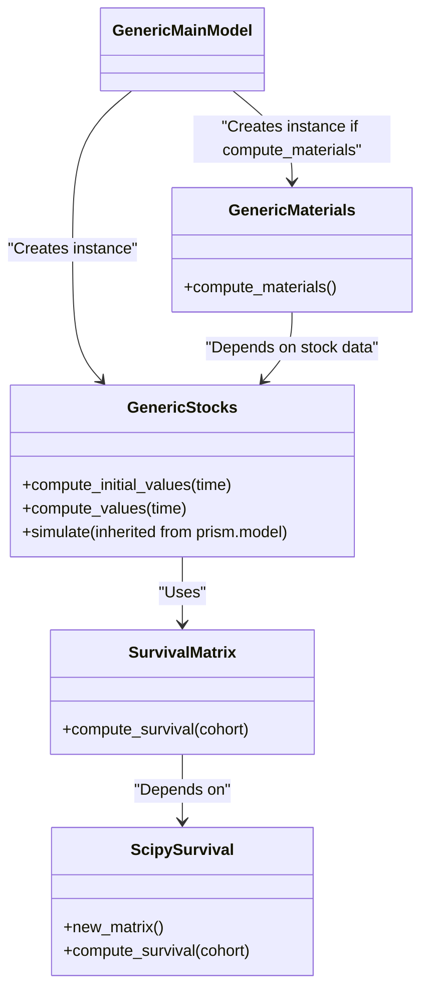
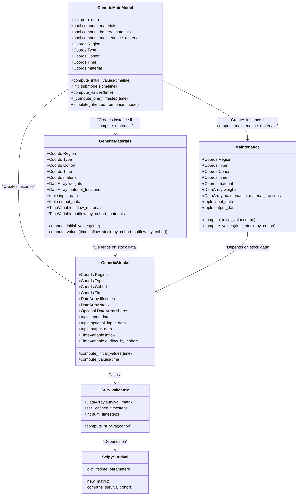

# imagematerials

## Overview

**imagematerials** is a standalone stock and material model that converts service demand data (e.g., kilometers traveled, goods transported, or square meters of built space) into product stock, such as vehicles, buildings, and roads. The model includes a detailed age structure of the product stock based on lifetime distributions and historical assumptions. It is designed for researchers analyzing material use patterns.

## Installation

### Setting up your Environment

Please refer to the [Default way of setting up your environment within IMAGE](docs/PYTHON_HOWTO.md)

### Prerequisites

General dependencies are listed in the pyproject.toml file and will be installed automatically when you install the image-materials package.
For developers: to install additional dependencies for documentation and testing, run

```bash
pip install -e ".[all]"
```
after you installed the package.

For **pint-xarray**, install it using:

```bash
pip install git+https://github.com/xarray-contrib/pint-xarray
```

Additionally, install **pym** and **prism** in the same environment from the IMAGEPBL GitHub repository:
1. Clone the repository
```bash
git clone https://github.com/imagepbl/pym.git
git clone https://github.com/imagepbl/prism.git
```
2. Install the packages
```bash
pip install ./pym
pip install ./prism
```

### Installing image-materials

Install the package locally in the parent directory of image-materials with:

```bash
pip install -e image-materials
```
Using `-e` ensures automatic updates when modifying the package.

## Usage

### Example Usage

Example notebooks are available in the `examples` folder (e.g., `vehicles.ipynb`, `buildings.ipynb`). Below is a basic usage example:

```python
from imagematerials import import_from_netcdf, GenericMainModel
import prism

# Load data
prep_data = import_from_netcdf("path/to/netcdf_file.nc")
time_start = 1960
complete_timeline = prism.Timeline(time_start, 2060, 1)
simulation_timeline = prism.Timeline(1970, 2060, 1)

# Create model
main_model_normal = GenericMainModel(
    complete_timeline, Region=Region, Time=Time, Cohort=Cohort, Type=Type, prep_data=prep_data,
    compute_materials=True, compute_battery_materials=False, compute_maintenance_materials=True, 
    material=material)    

# Run model
main_model_normal.simulate(simulation_timeline)
```

### Key Features

- **Stock Model**: Defined in `model.py` to track stock dynamics.
- **Material Calculations**: Estimates material demand based on product lifetimes and historical trends.

## Model Structure & Components

### Key Modules & Classes

- `GenericStocks`: Calculates stock dynamics using a **SurvivalMatrix**.
- `GenericMaterials`: Computes material demand based on cohort-specific stock levels.
- `SurvivalMatrix`: Generates a survival matrix using lifetime distributions.
- `ScipySurvival`: Uses SciPy statistical distributions to compute the survival matrix.

### Class Diagram


At the end of this readme a complete mermaid diagram including all class input data is added.

### Interaction with Other Models

The standalone version does not require **IMAGE**, but it can use **IMAGE outputs** (e.g., person-kilometers, floorspace demand) as inputs. In the long run, `imagematerials` is intended to be integrated as a submodule within **IMAGE**.

## Customization & Extensions

### Modifying Parameters & Extending Functionality

Users can extend the model by adding new modules for additional sectors. (More details to be added.)

### Configuration Files

- Constants are defined in `constant.py`.
- A **scenario file** will eventually be introduced for defining scenario parameters.

## Testing & Validation

### Running Tests

- Unit tests are defined in `tests.py`.
- Tests are **automatically executed** when a pull request is initialized.

### Example Runs

- Example test cases are included in the `examples` folder.
- Additional user feedback tests will be added in the future.

## Development & Collaboration

### Contributing

- please refer to our [Collaboration Guidelines](CONTRIBUTING.md) 

### Coding Standards

- Code should be **PEP8-compliant**.
- Follow **recursive modeling principles** and align with the **prism package**.

## Licence
### Licence
- please refer to our [licence statement](LICENCE.md)

## Contact & Support

### Questions & Issues

- Submit questions via **GitHub Issues**.

---

Complex class diagram:




